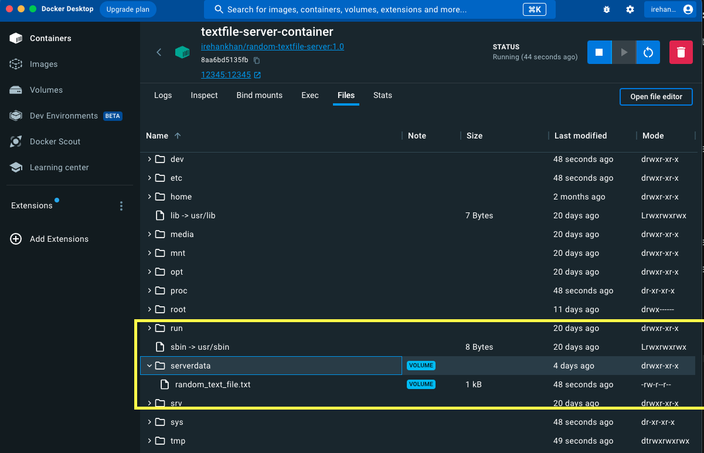
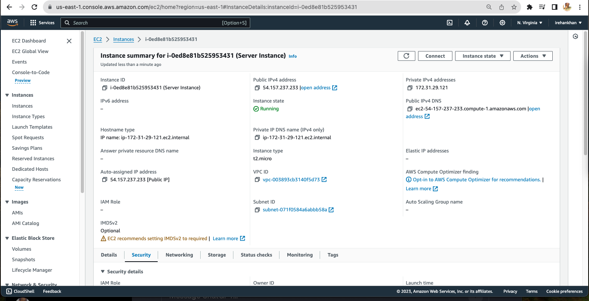
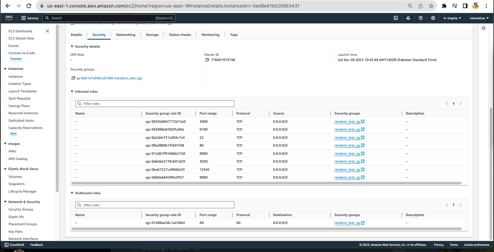
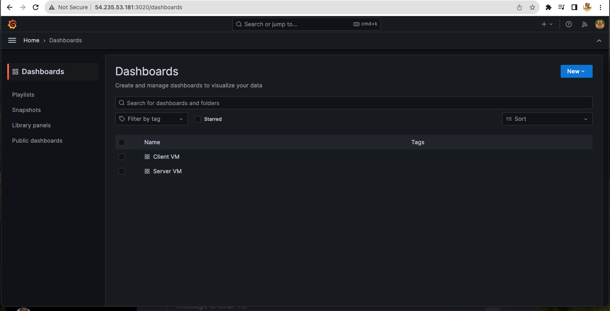
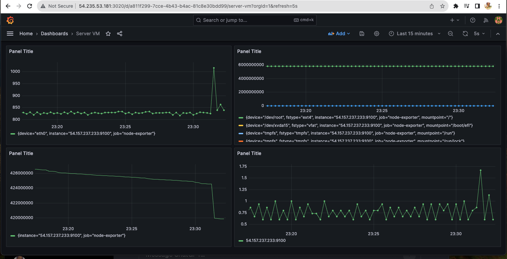
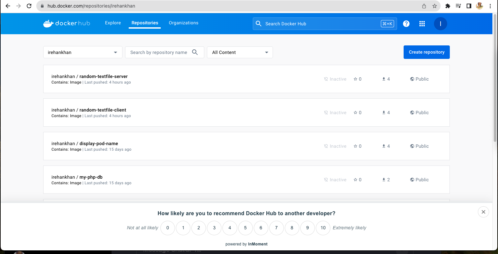
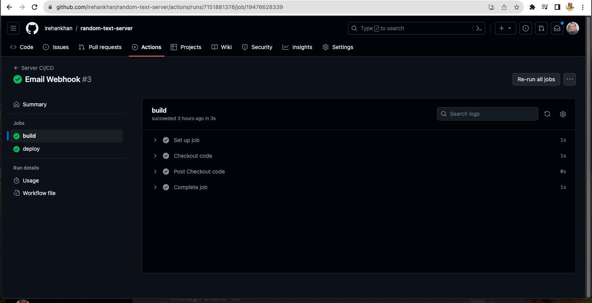
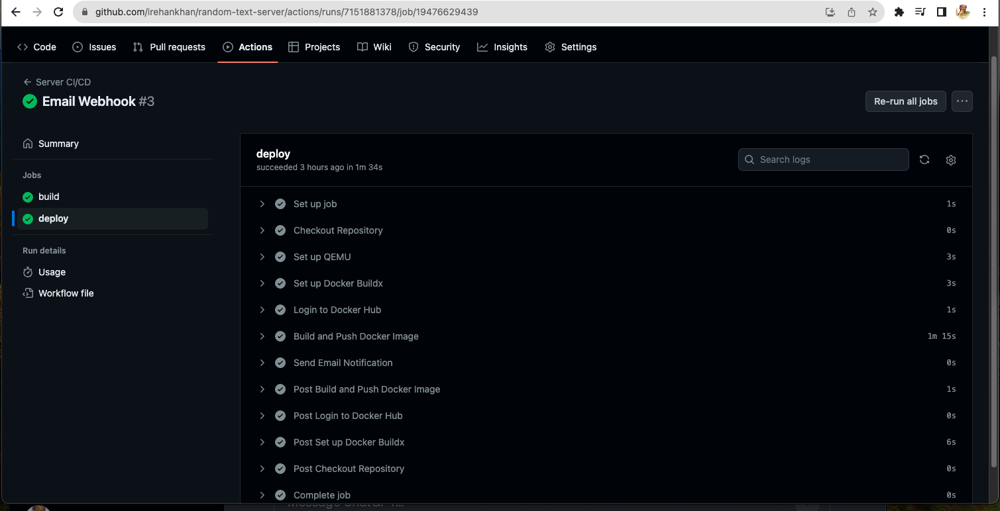

# Random Text Server

## Base Image
-   We will Use `python:3.9-slim` image from Docker Hub

## Dockerfile
```Dockerfile
# Use an official Python runtime as a parent image
FROM python:3.9-slim

# Set the working directory to /app
WORKDIR /app

# Copy the current directory contents into the container at /app
COPY . /app

# Install any needed packages specified in requirements.txt
RUN pip install --no-cache-dir -r requirements.txt

# Create a volume named "servervol" and mount it at "/serverdata" in the container
VOLUME /serverdata

# Run server.py when the container launches
CMD ["python", "./server.py"]
```
-   In above Dockerfile

- FROM python:3.9-slim:
    - It starts with an official Python runtime image, specifically version 3.9-slim. The slim tag indicates a lightweight version of the image, which contains only essential components for running Python applications.
- WORKDIR /app:
    - Sets the working directory inside the container to /app. All subsequent commands will be executed in this directory.
- COPY . /app:
    - Copies the contents of the current directory (the directory where the Dockerfile is located) into the container's /app directory. This includes your application code and any other files needed for the application.
- RUN pip install --no-cache-dir -r requirements.txt:
    - Installs the Python packages listed in requirements.txt using the pip package manager. The --no-cache-dir flag is used to avoid caching the downloaded packages in order to reduce the image size.
- VOLUME /serverdata:
    - Creates a Docker volume named "servervol" and mounts it at the path "/serverdata" inside the container. Volumes are used for persistent storage, allowing data to be shared between the host machine and the container.
- CMD ["python", "./server.py"]:
    - Specifies the default command to run when the container starts. In this case, it runs the server.py script using Python. The command is provided as a list to avoid potential issues with shell processing.
This Dockerfile sets up a Python environment, copies your application code into the container, installs required dependencies, creates a volume for persistent data, and defines the default command to run your server.py script.

## Server Script

This Python script appears to be a simple server-side implementation using sockets. Let's break down its main components:

- Function `generate_fixed_size_file(file_path, size_kb)`:
  - Generates a text file with a fixed size in kilobytes. It uses the lorem library to generate random text until the file reaches the specified size.
- Function `calculate_checksum(file_path)`:
  - Calculates both SHA-256 and MD5 checksums for a given file. It reads the file in chunks to efficiently calculate the checksums.
- Function `main()`:
  - Defines the main logic of the server script.
- Variables `host` and `port`:
  - Define the host IP address and port number on which the server will listen.
- Variable `file_name`:
  - Specifies the name of the file to be generated and sent.
- Variable `file_size_kb`:
  - Specifies the fixed size of the file in kilobytes.
- Variable `container_file_path`:
  - Specifies the absolute path within the container where the file will be stored.
- Variables `sha256_checksum` and `md5_checksum`:
  - Used to store the SHA-256 and MD5 checksums of the generated file.
- Generate File, Calculate Checksums, and Set Up Server Socket:
    - Calls the `generate_fixed_size_file` function to create the file.
    - Calls the `calculate_checksum` function to compute SHA-256 and MD5 checksums.
    - Sets up a socket server, binds it to the specified host and port, and listens for incoming connections.
- Accept Connection and Send File Information:
  - Accepts a connection from a client.
  - Reads the file content.
  - Combines the checksums and file data into a byte stream and sends it to the client.
- Execution Block:
  - Calls the main function when the script is executed.
This script generates a random text file of a specified size, calculates its checksums, and then serves the file and checksums to a connecting client over a socket connection. The server listens on a specified IP address and port.

## Docker Compose
```yml
version: "3"
services:
  server:
    build: .
    container_name: textfile-server-container
    image: irehankhan/random-textfile-server:1.0
    ports:
      - "12345:12345"
    volumes:
      - servervol:/serverdata

volumes:
  servervol:
```
-   In above Docker Compose File

This is a Docker Compose configuration file (docker-compose.yml) written in version 3 syntax. Let's break down its main components:

- Docker Compose Version:
```yaml
version: "3"
```
 - Specifies the version of the Docker Compose file format. In this case, it uses version 3.
- Services Section:
```yml
services:
  server:
```
 - Defines a service named "server" within the Docker Compose configuration.
- Service Configuration:
```yml
    build: .
    container_name: textfile-server-container
    image: irehankhan/random-textfile-server:1.0
    ports:
      - "12345:12345"
    volumes:
      - servervol:/serverdata
```
 - `build: .`: Specifies that the service should be built using the Dockerfile located in the current directory (`.`).
 - `container_name: textfile-server-container`: Sets a custom name for the container to "textfile-server-container."
 - `image: irehankhan/random-textfile-server:1.0`: Specifies the Docker image for the service. In this case, it uses the image from the "irehankhan/random-textfile-server" repository with version 1.0.
 - `ports: - "12345:12345"`: Maps port 12345 on the host to port 12345 on the container, allowing external access to the service.
 - `volumes: - servervol:/serverdata`: Creates a Docker volume named "`servervol`" and mounts it at the "`/serverdata`" directory within the container. This is typically used for persistent storage.
- Volumes Section:

```yml
volumes:
  servervol:
```
 - Defines a named volume named "servervol." Volumes provide a way to persist data generated by and used by Docker containers.

This Docker Compose file defines a service named "server" that builds an image from the current directory, sets up port mapping, and uses a named volume for persistent storage. The volume is mounted to the "/serverdata" directory inside the container. The service is associated with the Docker image "irehankhan/random-textfile-server:1.0."

## Deploy and Test
```logs
irehankhan@Rehans-Mac-mini server % docker-compose up --build -d
[+] Building 10.5s (10/10) FINISHED                        docker:desktop-linux
 => [server internal] load build definition from Dockerfile                0.0s
 => => transferring dockerfile: 566B                                       0.0s
 => [server internal] load .dockerignore                                   0.0s
 => => transferring context: 2B                                            0.0s
 => [server internal] load metadata for docker.io/library/python:3.9-slim  3.8s
 => [server auth] library/python:pull token for registry-1.docker.io       0.0s
 => [server 1/4] FROM docker.io/library/python:3.9-slim@sha256:65c30624fb  0.0s
 => => resolve docker.io/library/python:3.9-slim@sha256:65c30624fbccb71fe  0.0s
 => [server internal] load build context                                   0.0s
 => => transferring context: 20.28kB                                       0.0s
 => CACHED [server 2/4] WORKDIR /app                                       0.0s
 => [server 3/4] COPY . /app                                               0.6s
 => [server 4/4] RUN pip install --no-cache-dir -r requirements.txt        5.5s
 => [server] exporting to image                                            0.6s
 => => exporting layers                                                    0.6s
 => => writing image sha256:9f851bd49bd1b9648103e02cc0d53583a47f55853293f  0.0s 
 => => naming to docker.io/irehankhan/random-textfile-server:1.0           0.0s 
[+] Running 2/2                                                                 
 ✔ Network server_default               Create...                          0.0s 
 ✔ Container textfile-server-container  Started 
```


# Creating VMs, Infra as a Code (IaC)

We will create two AWS EC2 instances (VMs), one for hosting the server container and another for hosting the client container.
We will make sure that the VPC and subnets are appropriately to allow communication between the two EC2 instances. We use tc.micro instance type, which is covered in AWS free tier.
We will use terraform for infrastructure automation. We will place terraform scripts/configuration in the `terraform` directory of both client and server Github repositories.

- aws_key_pair.tf
This Terraform configuration defines an AWS Key Pair resource using the aws_key_pair provider.

- provider.tf
This Terraform configuration file includes configuration blocks for defining the required provider and configuring the AWS provider.

- ec2.tf
This Terraform configuration defines AWS resources for an EC2 instance and a security group. 
The ingress and egress blocks define rules for allowing incoming and outgoing traffic. In this example, rules are defined for ports 80, 12345, 22, 3020, 3000, 9100, 9090, and 8080, allowing traffic from all IP addresses (0.0.0.0/0).

We have to use below commands for applying above configurations.
`terraform init`
`terraform plan`
`terraform apply`





## Deploy and test Application on AWS Instances

You can Check log text file in my repo for complete steps
- Connect Via SSH to Server Instance
- Install Docker
- Install Docker Compose
- Install git for clone my repo to test application on instance.

# Setting up Monitoring Stack
- We will create another VM for grafana monitoring of each instance.
- Grafana dashboard will be accessible at port 3020.
- We will create dashboards to view metrics
- For that we have to install prometheus on server and client instance to get metrics.





# Setting up CI/CD pipelines

● Set up CI/CD pipelines for both repositories to ensure the following:
● Images are pushed to a public registry like Docker Hub.


● Configure the corresponding VMs as private Git runners.
```logs
Download
# Create a folder
$ mkdir actions-runner && cd actions-runner# Download the latest runner package
$ curl -o actions-runner-osx-x64-2.311.0.tar.gz -L https://github.com/actions/runner/releases/download/v2.311.0/actions-runner-osx-x64-2.311.0.tar.gz# Optional: Validate the hash
$ echo "f4d8d1dd850fd0889e0d250c82fa587b0e21934f8441143ee6772284b2ae6211  actions-runner-osx-x64-2.311.0.tar.gz" | shasum -a 256 -c# Extract the installer
$ tar xzf ./actions-runner-osx-x64-2.311.0.tar.gz

Configure
# Create the runner and start the configuration experience
$ ./config.sh --url https://github.com/irehankhan/random-text-server --token BDN3LJIEANPPU7NVY4QOL73FOTBCG# Last step, run it!
$ ./run.sh
```
We will run above commands on Server instance
Using your self-hosted runner
```logs 
# Use this YAML in your workflow file for each job
runs-on: self-hosted
```
● Update the image tag in Docker Compose, pull the new image, and deploy it as part of
the CD process.

```yml
version: "3"
services:
  server:
    image: irehankhan/random-textfile-server:1.0
    container_name: textfile-server-container

    ports:
      - "12345:12345"
    volumes:
      - servervol:/serverdata

volumes:
  servervol:
```

● Integrate a Slack webhook (or another app of your choice) for deployment notifications

Please check workflow file.





## Grafana repo
https://github.com/irehankhan/grafana

# Thank You!
